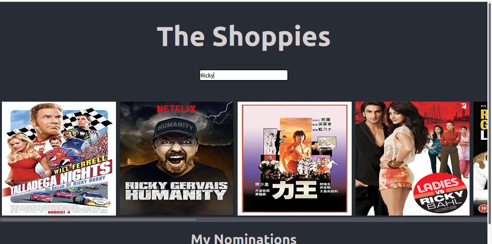

# The Shoppies

Search for your favourite movies and nominate them for the Shoppies award show. You can only nominate 5 of your favourite movies, but can change your selection by removing a movie from the nomination list, as many time as you want. The nomination list will persist even if you close the tab and reload the app.

Find the deployed app [here](https://the-shoppies-c4595.web.app)

Built with [ReactJS](https://reactjs.org/), [Material UI](https://material-ui.com/). All movie data comes from the [OMDB API](http://www.omdbapi.com/). Deployed to [Firebase](https://firebase.google.com/)

# Getting Started with Create React App

This project was bootstrapped with [Create React App](https://github.com/facebook/create-react-app).

## Available Scripts

In the project directory, you can run:

### `yarn start`

Runs the app in the development mode.\
Open [http://localhost:3000](http://localhost:3000) to view it in the browser.

The page will reload if you make edits.\
You will also see any lint errors in the console.